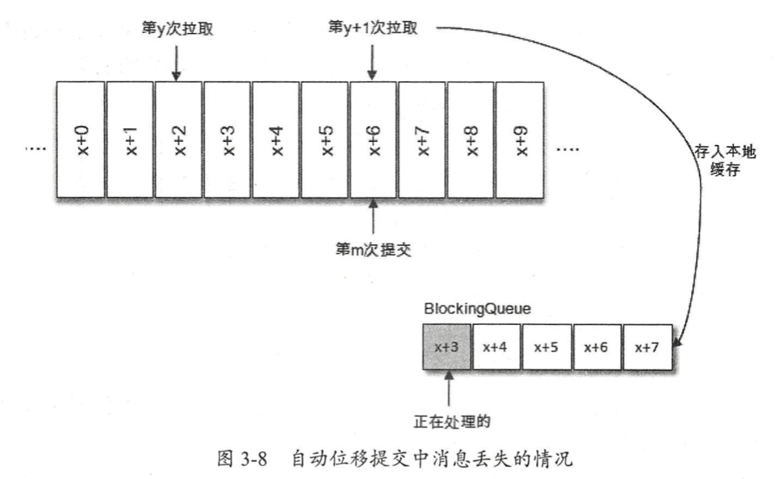

# 实现Kafka至少消费一次

> 在实际重要的场景中，常常需要实现消费者至少消费一次。因为使用默认的kafka消费者存在某些问题。

## 默认的kafka消费者存在什么问题？

（1）需要自己实现重新消费数据

> 在刚开始思考时，有人认为实现重复消费还不简单？取消自动提交，确认一批消息已经消费成功就执行手动提交，否则不提交；之后重新获取未提交的数据，就可以达到重复消费的目的。 
> 
> 可是，事实是残酷的，试一次就知道，感觉手动不提交没有用一样😂，消费者一直在往后消费。

对于Kafka中的分区而言，它的每条消息都有唯一的 offset ，用来表示消息在分区中对应的位置（called：偏移量）。 对于消费者而言，它也有一个 offset 的概念，消费者使用offset来表示消费到分区中某个消息所在的位置（called：位移）。偏移量存储在Kafka内部的主题 __consumer_offsets 中，而位移存储在消费者端的内存中。“提交”就是将消费者端存储的位移存储到 __consumer_offsets 持久化，当消费者发生崩溃或发生消费者重平衡时，就会去读取存储在 __consumer_offsets 中的偏移量，其他正常情况下都是按内存存储的位移在顺序读取。因此，按照上述操作就会出现提交没用的效果。

（2）自动提交情况下，可能出现消息丢失情况
拉取线程 A 不断地拉取消息并存入本地缓存，比如在 BlockingQueue 中，另一个处理线程 B 从缓存中读取消息并进行相应的逻辑处理。假设目前进行到了第 y+1 次拉取，以及第 m 次位移提交的时候，也就是 x+6 之前的位移己经确认提交了，处理线程 B 却还正在消费 x+3 的消息 。 此时如果处理线程B 发生了异常，待其恢复之后会从第 m 次位移提交处，也就是 x+6 的位置开始拉取消息，那么 x+3 至 x+6 之间的消息就没有得到相应的处理，这样便发生消息丢失的现象 。



## 实现至少消费一次

> 语言：python 3.8
> 工具：confluent-kafka

目前有2个思路，第1个时新建一个重试队列，当遇到问题消息时将其插入到重试队列中，消费者可以再次获取到该问题消息并再次消费。第2个是通过 seek 方法设置位移到指定发生问题的位置，使得重新消费问题消息；

### 加入重试队列再次消费
```python
class KafkaAtLeastOnceConsumer(object):
    """
    注意：
    1. 用户方法须返回Boolean类型数据，False将可能重新消费该数据
    2. 用户消息内容不得包含 try_count、old_topic 关键字

    """

    run_flag = True
    if config.DEBUG:
        total_set = set()

    def __init__(
            self,
            group_id: str,
            topic_list: List,
            user_function: Callable,
            servers: List = config.KAFKA_HOST,
            consumer_count: int = 5,
            reset_type: str = 'latest',
            concurrency: int = 5,
            batch_size: int = 500,
            timeout: int = 1,
            base_mode: bool = False,
            retry_count: int = 3,
    ):
        assert consumer_count > 0, '消费者数目须大于0'
        assert concurrency > 0, '消费者并发度须大于0'
        assert batch_size > concurrency, '单批消息数须大于并发度'
        assert timeout > 0, '获取消息超时时间须大于0'
        assert retry_count > -2, '重试次数应大于等于-1'

        self._consumer_count = consumer_count
        self._pool = ThreadPoolExecutor(max_workers=self._consumer_count)
        self._servers = ','.join(servers)
        self._group_id = group_id
        self._user_function = user_function
        self._reset_type = reset_type
        self._topic_list = topic_list
        self._concurrency = concurrency
        self._batch_size = batch_size
        self._timeout = timeout
        self._retry_count = retry_count

        self._process_num_per_thread = 100
        self._retry_topic_name = 'kfk_retry_queue'
        self._inner_producer = None

        self._topic_list.append(self._retry_topic_name)
        if base_mode:
            self._retry_count = 0

    def start(self) -> None:
        for i in range(self._consumer_count):
            self._pool.submit(self._core)

    def shutdown(self) -> None:
        KafkaAtLeastOnceConsumer.run_flag = False

    def _split_msgs(self, msgs: List) -> List:
        msg_num = len(msgs)
        if msg_num <= self._process_num_per_thread * self._concurrency:
            process_num_per_thread = self._process_num_per_thread
        else:
            process_num_per_thread = int(msg_num / self._concurrency)
        return list(chunked(msgs, process_num_per_thread))

    def _core(self) -> None:
        try:
            consumer = self._init_consumer()
            batch_pool = ThreadPoolExecutor(max_workers=self._concurrency)
            while KafkaAtLeastOnceConsumer.run_flag:
                msgs = consumer.consume(num_messages=self._batch_size, timeout=self._timeout)
                if not msgs:
                    continue
                if config.DEBUG:
                    log.info(f'开始处理一批消息')
                msg_lists = self._split_msgs(list(msgs))
                threads = []
                for msg_list in msg_lists:
                    t = batch_pool.submit(self._thread_run, msg_list)
                    threads.append(t)
                wait(threads)
                consumer.commit()
                if config.DEBUG:
                    log.info(f'完成处理一批消息')
                    log.info(f'total_set:{len(KafkaAtLeastOnceConsumer.total_set)}')
                    time.sleep(1)
        except Exception as e:
            log.exception(e)
        finally:
            try:
                if consumer:
                    consumer.close()
                if batch_pool:
                    batch_pool.shutdown()
            except Exception as e:
                log.exception(e)

    def _thread_run(self, msg_list) -> None:
        for msg in msg_list:
            msg_map = json.loads(msg.value().decode('utf-8'))
            if 'old_topic' in msg_map and msg_map['old_topic'] not in self._topic_list:
                continue

            try:
                func_is_success = self._user_function(msg)
            except Exception:
                func_is_success = False

            if not func_is_success:
                if msg.topic() == self._retry_topic_name:
                    try_count = msg_map.get('try_count', 0)
                else:
                    try_count = 0
                if self._retry_count == 0 or (0 < self._retry_count <= try_count):
                    continue
                else:
                    # 重试操作
                    if not self._inner_producer:
                        self._inner_producer = self._init_producer()
                    msg_map['try_count'] = try_count + 1
                    msg_map['old_topic'] = self._topic_list[0]
                    self._inner_producer.produce(self._retry_topic_name, json.dumps(msg_map))
            elif config.DEBUG:
                KafkaAtLeastOnceConsumer.total_set.add(json.loads(msg.value().decode('utf-8'))['t'])

    def _init_consumer(self) -> Consumer:
        _consumer = Consumer(
            {
                'bootstrap.servers': self._servers,
                'group.id': self._group_id,
                'auto.offset.reset': self._reset_type,
                'enable.auto.commit': False,
            }
        )
        _consumer.subscribe(self._topic_list)
        return _consumer

    def _init_producer(self) -> Producer:
        _producer = Producer(
            {
                'bootstrap.servers': ','.join(config.KAFKA_HOST),
            }
        )
        return _producer
```

1. 同时开启 consumer_count 个消费者并处于同一分组中，为了提高吞吐量，每个消费者又会开启 concurrency 个线程去消费数据
2. 当消费消费出现异常或返回False，并且重试次数没有使用完毕，就会将初始消息以及重试次数发送到“重试队列”
3. 关闭自动提交，开启手动提交，当消费者端崩溃或再平衡时再次消费未提交数据。


测试代码：
```python
def _get_msg_data(msg):
    p = msg.partition()
    o = msg.offset()
    t = msg.topic()
    value = msg.value().decode('utf-8')
    return p, o, t, value


def my_function(msg):
    if msg.error():
        log.error('fetch msg is error. error:%s' % msg.error())
        return False
    # 处理业务逻辑，单次问题进行重试
    p, o, t, value = _get_msg_data(msg)
    if random.randint(1, 100) == 9:
        log.info(f"发生业务异常返回False, topic:{t}, partition:{p},  offset {o}, value:{value['t']} ")
        return False
    else:
        log.info(f'业务处理消息，topic:{t}, partition:{p}, offset:{o}, content:{value}')
        return True


def success_function(msg):
    # 处理业务逻辑，完全正常
    if msg.error():
        log.error('fetch msg is error. error:%s' % msg.error())
        return False
    p, o, t, value = _get_msg_data(msg)
    log.info(f'业务处理消息，topic:{t}, partition:{p}, offset:{o}, content:{value}')
    return True


def exception_function(msg):
    # 处理业务逻辑，抛出异常重试
    if msg.error():
        log.error('fetch msg is error. error:%s' % msg.error())
        return False
    p, o, t, value = _get_msg_data(msg)
    if random.randint(1, 100) == 9:
        log.info(f"发生业务异常返回False, topic:{t}, partition:{p},  offset {o}, value:{value['t']} ")
        raise Exception('业务异常')
    else:
        log.info(f'业务处理消息，topic:{t}, partition:{p}, offset:{o}, content:{value}')
        return True


def test_normal_try_limit(retry_count):
    # 用户函数返回false重试(-1无限/数字为重试次数)
    consumer = KafkaAtLeastOnceConsumer(group_id, [topic], my_function, retry_count=retry_count)
    consumer.start()
    while True:
        time.sleep(10)


def test_exception_try_limit(retry_count):
    # 异常指定重试次数(-1无限/数字为重试次数)
    consumer = KafkaAtLeastOnceConsumer(group_id, [topic], exception_function, retry_count=retry_count)
    consumer.start()
    while True:
        time.sleep(10)


def test_normal_no_try():
    # 基本模式
    consumer = KafkaAtLeastOnceConsumer(group_id, [topic], my_function, base_mode=True)
    consumer.start()
    while True:
        time.sleep(10)


def test_crash_consume():
    # 模拟消费者关停/崩溃，消费者继续消费
    consumer = KafkaAtLeastOnceConsumer(group_id, [topic], success_function, base_mode=True)
    consumer.start()
    time.sleep(20)
    consumer.shutdown()


if __name__ == '__main__':
    test_channel = sys.argv[1]
    if test_channel == "1":
        test_normal_try_limit(-1)
    elif test_channel == "2":
        test_normal_try_limit(3)
    elif test_channel == "3":
        test_exception_try_limit(-1)
    elif test_channel == "4":
        test_exception_try_limit(3)
    elif test_channel == "5":
        test_normal_no_try()
    elif test_channel == "6":
        test_crash_consume()
    else:
        test_normal_try_limit(-1)
```

### 使用seek方法再次消费

理论上来讲，这种方法是能行的通的。因为seek能将一个活跃分区的消费位移设置到消费失败的位置，然后下一次拉取时可以重新获取该数据，并且相比使用“重试队列”，seek方式还可以保证消息部分顺序。
但是seek在批量处理下存在[未知问题](https://github.com/confluentinc/confluent-kafka-python/issues/1443)，后面再研究。
