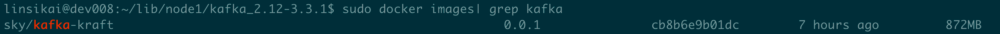
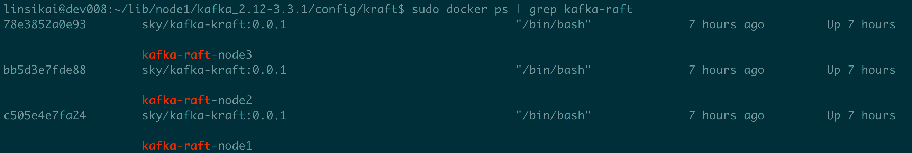
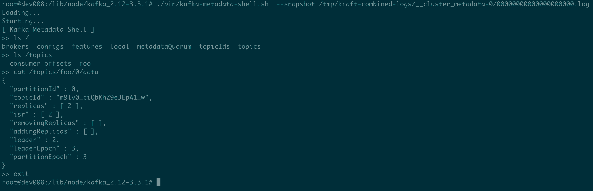

## 1 Docker镜像准备
因为这里需要使用Docker模式3台主机，因此以ubuntu系统为基础，封装自己的镜像。
### 1.1 下载Kafka
下载 `kafka_2.12-3.3.1.tgz` 到本地（/home/linsikai/lib/node1），下载地址：[kafka_2.12-3.3.1.tgz下载](https://downloads.apache.org/kafka/3.3.1/kafka_2.12-3.3.1.tgz)
### 1.2 配置容器
1. 以ubuntu系统为底创建容器
```shell
$ sudo docker run -it -v /home/linsikai/tmp/node1/kraft-combined-logs:/tmp/kraft-combined-logs -v /home/linsikai/lib/node1:/lib/node --name kafka-raft-node ubuntu:latest /bin/bash
```
2. 安装Java：`apt-get update -y & apt-get install openjdk-11-jdk -y`
> 注意：自kafka3.0开始，java8已被标注舍弃，并且将于kafka4.0彻底废弃。推荐使用java11、java17
3. 安装Vim：`apt-get install vim -y`
4. 封装镜像：`sudo docker commit  [容器id] sky/kafka-kraft:0.0.1`



### 1.3 修改kafka配置
复制三份kafka解压数据，并分别进入kafka安装目录（`/home/linsikai/lib/node1`，`/home/linsikai/lib/node2`，`/home/linsikai/lib/node2`），打开配置文件：`vim config/kraft/server.properties`
1. node1节点配置，kraft需要注意的配置项包括以下：
```shell
# The role of this server. Setting this puts us in KRaft mode
process.roles=broker,controller

# The node id associated with this instance's roles
node.id=1

# The connect string for the controller quorum
controller.quorum.voters=1@127.0.0.1:9033,2@127.0.0.1:9034,3@127.0.0.1:9035

# The address the socket server listens on.
# Combined nodes (i.e. those with `process.roles=broker,controller`) must list the controller listener here at a minimum.
listeners=PLAINTEXT://:9023,CONTROLLER://:9033

# Name of listener used for communication between brokers.
inter.broker.listener.name=PLAINTEXT

# Listener name, hostname and port the broker will advertise to clients.
# If not set, it uses the value for "listeners".
advertised.listeners=PLAINTEXT://127.0.0.1:9023

# A comma-separated list of the names of the listeners used by the controller.
# If no explicit mapping set in `listener.security.protocol.map`, default will be using PLAINTEXT protocol
# This is required if running in KRaft mode.
controller.listener.names=CONTROLLER

# A comma separated list of directories under which to store log files
log.dirs=/tmp/kraft-combined-logs
```


（2）node2节点配置
```shell
# The role of this server. Setting this puts us in KRaft mode
process.roles=broker,controller

# The node id associated with this instance's roles
node.id=2

# The connect string for the controller quorum
controller.quorum.voters=1@127.0.0.1:9033,2@127.0.0.1:9034,3@127.0.0.1:9035

# The address the socket server listens on.
# Combined nodes (i.e. those with `process.roles=broker,controller`) must list the controller listener here at a minimum.
listeners=PLAINTEXT://:9024,CONTROLLER://:9034

# Name of listener used for communication between brokers.
inter.broker.listener.name=PLAINTEXT

# Listener name, hostname and port the broker will advertise to clients.
# If not set, it uses the value for "listeners".
advertised.listeners=PLAINTEXT://127.0.0.1:9024

# A comma-separated list of the names of the listeners used by the controller.
# If no explicit mapping set in `listener.security.protocol.map`, default will be using PLAINTEXT protocol
# This is required if running in KRaft mode.
controller.listener.names=CONTROLLER

# A comma separated list of directories under which to store log files
log.dirs=/tmp/kraft-combined-logs
```
（3）node3节点
```shell
# The role of this server. Setting this puts us in KRaft mode
process.roles=broker,controller

# The node id associated with this instance's roles
node.id=3
``
# The connect string for the controller quorum
controller.quorum.voters=1@127.0.0.1:9033,2@127.0.0.1:9034,3@127.0.0.1:9035

# The address the socket server listens on.
# Combined nodes (i.e. those with `process.roles=broker,controller`) must list the controller listener here at a minimum.
listeners=PLAINTEXT://:9025,CONTROLLER://:9035

# Name of listener used for communication between brokers.
inter.broker.listener.name=PLAINTEXT

# Listener name, hostname and port the broker will advertise to clients.
# If not set, it uses the value for "listeners".
advertised.listeners=PLAINTEXT://127.0.0.1:9025

# A comma-separated list of the names of the listeners used by the controller.
# If no explicit mapping set in `listener.security.protocol.map`, default will be using PLAINTEXT protocol
# This is required if running in KRaft mode.
controller.listener.names=CONTROLLER

# A comma separated list of directories under which to store log files
log.dirs=/tmp/kraft-combined-logs
```
## 2 部署Kafka集群
### 2.1 启动节点容器
分别启动3台节点容器
```shell
docker run -itd --network host -v /home/linsikai/tmp/node1/kraft-combined-logs:/tmp/kraft-combined-logs -v /home/linsikai/lib/node1:/lib/node --name kafka-raft-node1 sky/kafka-kraft:0.0.1 /bin/bash
docker run -itd --network host -v /home/linsikai/tmp/node2/kraft-combined-logs:/tmp/kraft-combined-logs -v /home/linsikai/lib/node2:/lib/node --name kafka-raft-node2 sky/kafka-kraft:0.0.1 /bin/bash
docker run -itd --network host -v /home/linsikai/tmp/node3/kraft-combined-logs:/tmp/kraft-combined-logs -v /home/linsikai/lib/node3:/lib/node --name kafka-raft-node3 sky/kafka-kraft:0.0.1 /bin/bash
```



### 2.2 生成一个 Cluster ID
`sudo docker exec -it [容器id] /bin/bash`进入任意一个容器，执行下面：（其实也可以不用执行，测试的话写成AAAAAAA都可以，保证唯一就行）
```shell
$ ./bin/kafka-storage.sh random-uuid
TaMk2qkGSLaWEPo2ru86Kw
```
由以前自动生成改手动生成的原因参见：3.4小节 Kafka存储工具。
### 2.3 格式化存储目录
下一步是格式化存储目录。如果运行单节点，可以使用以下命令：
```shell
$ ./bin/kafka-storage.sh format -t TaMk2qkGSLaWEPo2ru86Kw -c ./config/kraft/server.properties
Formatting /tmp/kraft-combined-logs with metadata.version 3.3-IV3.
```
如果运行集群，需要给每个节点运行格式化命令。 
> 注意：需要使用相同的集群 Cluster ID
### 2.4 启动kafka服务
最后，启动每一个kafka节点。
```shell
$ ./bin/kafka-server-start.sh ./config/kraft/server.properties

# 后台运行
$ ./bin/kafka-server-start.sh -daemon ./config/kraft/server.properties
```
之后就可以愉快地玩耍了，例如常见topic
```shell
$ ./bin/kafka-topics.sh --create --topic foo --partitions 1 --replication-factor 1 --bootstrap-server 127.0.0.1:9023
Created topic foo.
```
## 3 知识
### 3.1 控制器服务器
在KRaft模式下，只有一小部分服务器可以充当controller（与基于ZooKeeper的模式不同：任何服务器都可以成为controller）。被选择的controller将参与元数据仲裁。每个controller都处于活动状态，或者是当前活动controller的热备用状态。

通常会为该角色选择3或5台服务器，这取决于成本和系统在不影响可用性的情况下应承受的并发故障数等因素。就像ZooKeeper一样，为了保持可用性，必须使大多数contrller保持活动状态。 因此，如果有3个控制器，可以容忍1个故障；使用5个控制器，可以容忍2个故障。
### 3.2 进程角色
现在，每个Kafka服务器都有一个名为`process.roles`的参数，其值如下：
- broker：一个普通Kafka节点
- controller：一个Kafka控制器
- broker,controller：同时有broker、controller角色
- 不设置：认为是ZooKeeper模式

充当broker和controller的节点称为“组合”节点。对于简单的用例，组合节点更易于操作。缺点是controller与系统的其余部分的隔离度较低。例如，如果broker上的活动导致内存不足，则服务器的controller不会与该OOM条件隔离。

### 3.3 仲裁投票者
系统中的所有节点都必须设置`controller.quorum.voters`参数。这标识了应该使用的仲裁controller，必须枚举所有controller。这类似于使用ZooKeeper时，`ZooKeeper.connect`配置必须包含所有ZooKeeperServer。然而与ZooKeeper配置不同是，“controller.quorum.voters”参数也具有每个节点的ID。格式为 `id1@host1:port1,id2@host2:port2` 等。

因此，如果有10个broker和3个名为 controller1、controller2、controller3 的controller，那么可能在controller1上具有以下配置：
```shell
process.roles=controller
node.id=1
listeners=CONTROLLER://controller1.example.com:9093
controller.quorum.voters=1@controller1.example.com:9093,2@controller2.example.com:9093,3@controller3.example.com:9093
```
每个broker和每个controller都必须设置`controller.quorum.voters`。请注意，`controller.quorum.voters`配置中提供的节点ID必须与提供给服务器的节点ID匹配。因此，在controller1上，node.id必须设置为1，依此类推。注意，controller ID不需要从0或1开始。然而，分配节点ID的最简单和最不容易混淆的方法可能只是给每个服务器一个数字ID，从0开始。还要注意，每个节点ID在特定集群中的所有节点上必须是唯一的；任何两个节点都不能具有相同的节点ID，而不管其“process.roles”值如何。
### 3.4 Kafka存储工具
如上所述，在快速开始部分中，必须使用`kafka storage.sh`工具为新集群生成Cluster ID，然后在启动节点之前在每个节点上运行格式化命令。
> 在1.0和2.0的版本里面，集群ID是自动生成的，存储数据目录是自动生成的。那为什么在3.0会这样做呢？

社区的的思考是这样子的，即自动格式化有时候会掩盖一些异常，比如，在Unix中，如果一个数据目录不能被挂载，它可能显示为空白，在这种情况下，自动格式化将是将会带来一些问题。这个特性对于 Controller 服务器维护元数据日志特别重要，因为如果三个 Controller 节点中有两个能够从空白日志开始，那么可能会在日志中没有任何内容的情况下，选出一个Leader，这会导致所有的元数据丢失(KRaft 仲裁后发生截断)。一旦发生这个问题，将会是不可逆的故障。

### 3.5 缺失的能力
以下特性还未完全实现：
- 通过管理API配置SCRAM用户
- 支持具有多个存储目录的JBOD配置
- 修改单独阳性KRaft controller上的某些动态配置
- 委派令牌
- 从ZooKeeper模式升级
### 3.6 Debug
如果遇到问题，可能需要查看元数据日志。
#### 3.6.1 kafka-dump-log
查看元数据日志的一种方法是使用`kafka-dump-log.sh`工具，如下所示：
```shell
$ ./bin/kafka-dump-log.sh  --cluster-metadata-decoder --skip-record-metadata --files /tmp/kraft-combined-logs/__cluster_metadata-0/*.log
Dumping /tmp/kraft-combined-logs/__cluster_metadata-0/00000000000000000000.log
Starting offset: 0
baseOffset: 0 lastOffset: 0 count: 1 baseSequence: -1 lastSequence: -1 producerId: -1 producerEpoch: -1 partitionLeaderEpoch: 1 isTransactional: false isControl: true position: 0 CreateTime: 1614382631640 size: 89 magic: 2 compresscodec: NONE crc: 1438115474 isvalid: true

baseOffset: 1 lastOffset: 1 count: 1 baseSequence: -1 lastSequence: -1 producerId: -1 producerEpoch: -1 partitionLeaderEpoch: 1 isTransactional: false isControl: false position: 89 CreateTime: 1614382632329 size: 137 magic: 2 compresscodec: NONE crc: 1095855865 isvalid: true
payload: {"type":"REGISTER_BROKER_RECORD","version":0,"data":{"brokerId":1,"incarnationId":"P3UFsWoNR-erL9PK98YLsA","brokerEpoch":0,"endPoints":[{"name":"PLAINTEXT","host":"localhost","port":9092,"securityProtocol":0}],"features":[],"rack":null}}
baseOffset: 2 lastOffset: 2 count: 1 baseSequence: -1 lastSequence: -1 producerId: -1 producerEpoch: -1 partitionLeaderEpoch: 1 isTransactional: false isControl: false position: 226 CreateTime: 1614382632453 size: 83 magic: 2 compresscodec: NONE crc: 455187130 isvalid: true
payload: {"type":"UNFENCE_BROKER_RECORD","version":0,"data":{"id":1,"epoch":0}}
baseOffset: 3 lastOffset: 3 count: 1 baseSequence: -1 lastSequence: -1 producerId: -1 producerEpoch: -1 partitionLeaderEpoch: 1 isTransactional: false isControl: false position: 309 CreateTime: 1614382634484 size: 83 magic: 2 compresscodec: NONE crc: 4055692847 isvalid: true
payload: {"type":"FENCE_BROKER_RECORD","version":0,"data":{"id":1,"epoch":0}}
baseOffset: 4 lastOffset: 4 count: 1 baseSequence: -1 lastSequence: -1 producerId: -1 producerEpoch: -1 partitionLeaderEpoch: 2 isTransactional: false isControl: true position: 392 CreateTime: 1614382671857 size: 89 magic: 2 compresscodec: NONE crc: 1318571838 isvalid: true

baseOffset: 5 lastOffset: 5 count: 1 baseSequence: -1 lastSequence: -1 producerId: -1 producerEpoch: -1 partitionLeaderEpoch: 2 isTransactional: false isControl: false position: 481 CreateTime: 1614382672440 size: 137 magic: 2 compresscodec: NONE crc: 841144615 isvalid: true
payload: {"type":"REGISTER_BROKER_RECORD","version":0,"data":{"brokerId":1,"incarnationId":"RXRJu7cnScKRZOnWQGs86g","brokerEpoch":4,"endPoints":[{"name":"PLAINTEXT","host":"localhost","port":9092,"securityProtocol":0}],"features":[],"rack":null}}
baseOffset: 6 lastOffset: 6 count: 1 baseSequence: -1 lastSequence: -1 producerId: -1 producerEpoch: -1 partitionLeaderEpoch: 2 isTransactional: false isControl: false position: 618 CreateTime: 1614382672544 size: 83 magic: 2 compresscodec: NONE crc: 4155905922 isvalid: true
payload: {"type":"UNFENCE_BROKER_RECORD","version":0,"data":{"id":1,"epoch":4}}
baseOffset: 7 lastOffset: 8 count: 2 baseSequence: -1 lastSequence: -1 producerId: -1 producerEpoch: -1 partitionLeaderEpoch: 2 isTransactional: false isControl: false position: 701 CreateTime: 1614382712158 size: 159 magic: 2 compresscodec: NONE crc: 3726758683 isvalid: true
payload: {"type":"TOPIC_RECORD","version":0,"data":{"name":"foo","topicId":"5zoAlv-xEh9xRANKXt1Lbg"}}
payload: {"type":"PARTITION_RECORD","version":0,"data":{"partitionId":0,"topicId":"5zoAlv-xEh9xRANKXt1Lbg","replicas":[1],"isr":[1],"removingReplicas":null,"addingReplicas":null,"leader":1,"leaderEpoch":0,"partitionEpoch":0}}
```
#### 3.6.2 元数据shell
另一个检查元数据日志的工具是`kafka-metadata-shell.sh`。就像ZooKeeper shell一样，可以检查集群的元数据。
```shell
./bin/kafka-metadata-shell.sh  --snapshot /tmp/kraft-combined-logs/__cluster_metadata-0/00000000000000000000.log
```


