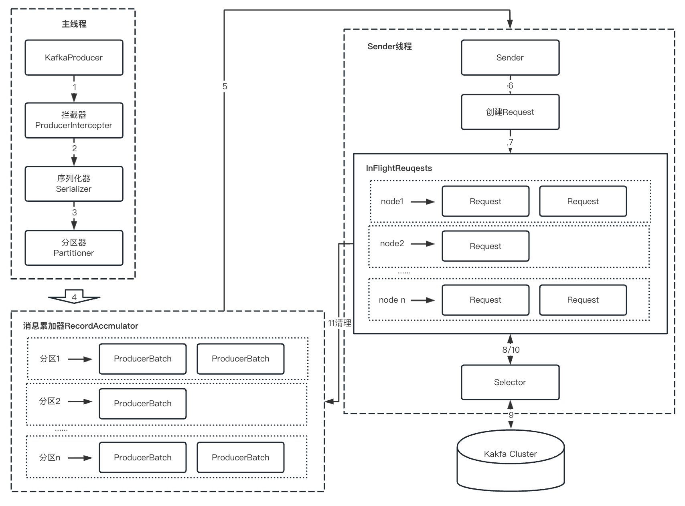
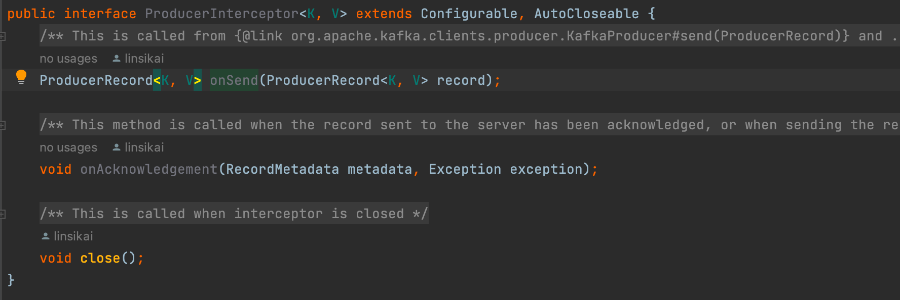
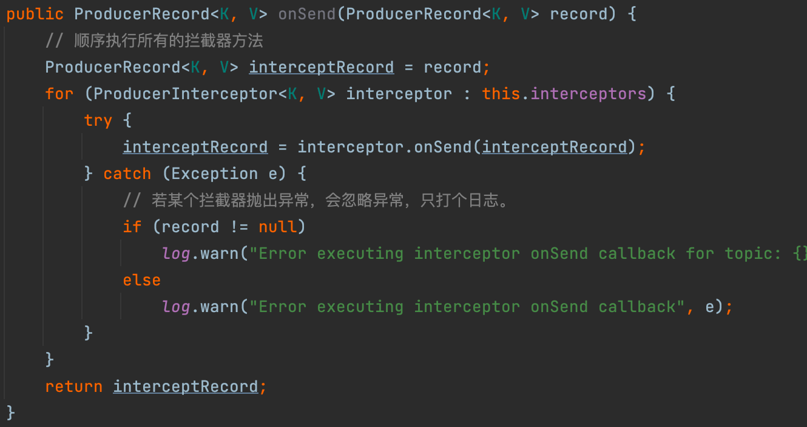
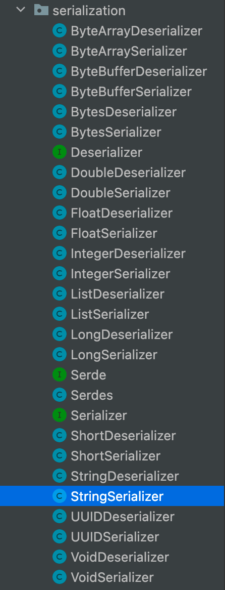
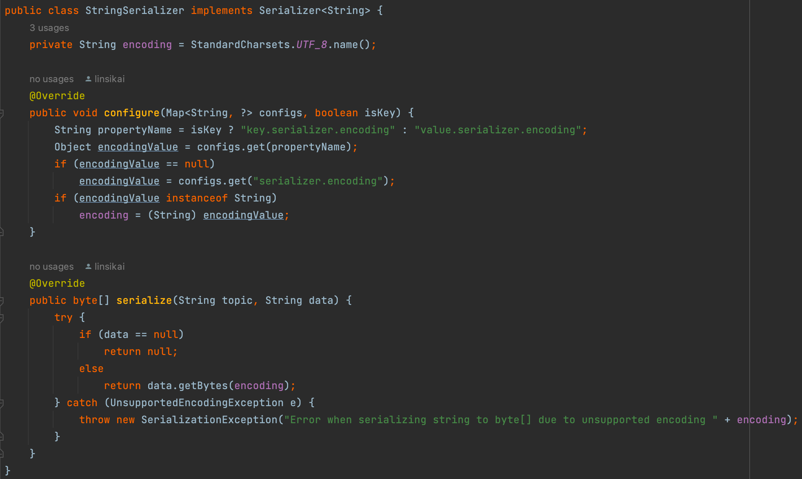
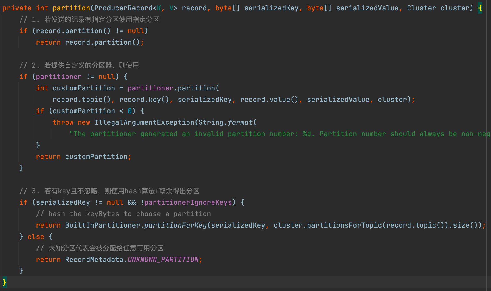
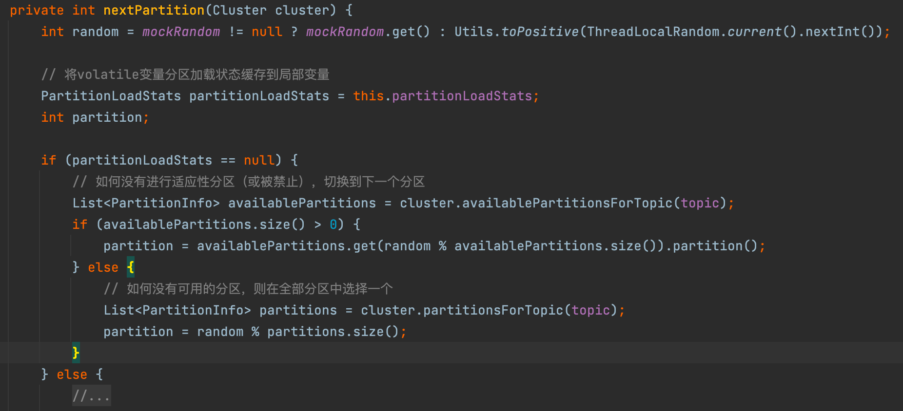
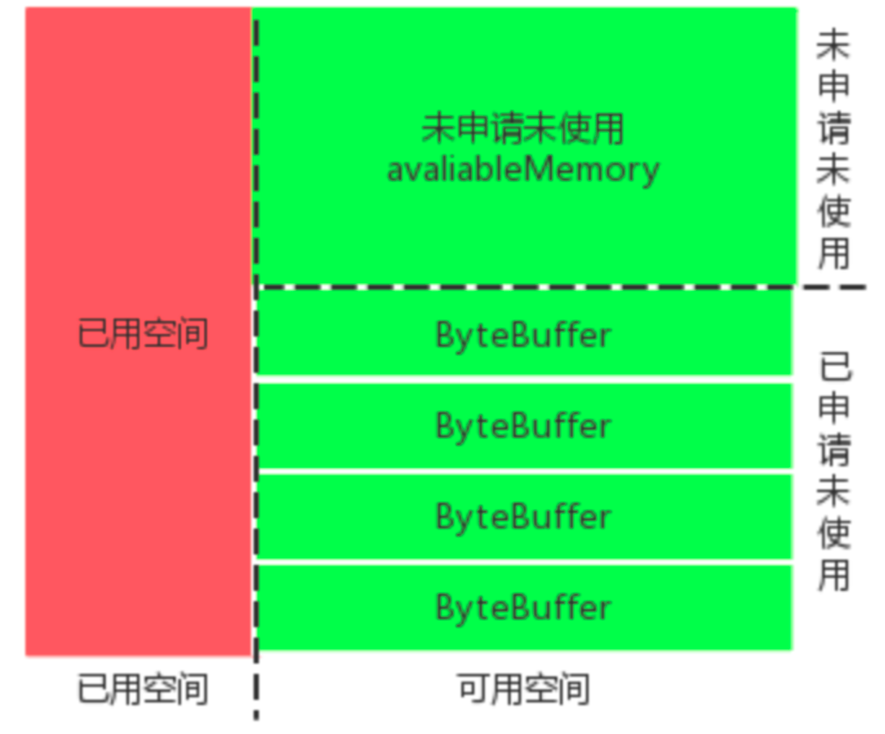
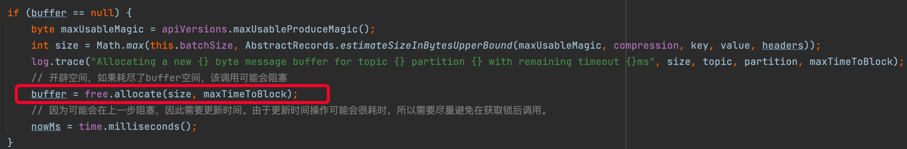

# （1）Kafka源码分析系列-生产者

首先，以Java语言使用Kafka组件为例，列出一个Kakfa生产者的使用代码案例，如下：
```Java
import org.apache.kafka.clients.producer.*;
import org.apache.kafka.common.serialization.StringSerializer;

import java.util.Properties;
import java.util.concurrent.ExecutionException;

public class ProducerDemo {
    public static void main(String[] args) {
        boolean isAsync = args.length == 0 || !args[0].trim().equalsIgnoreCase("sync");

        Properties properties = new Properties();
        properties.put(ProducerConfig.BOOTSTRAP_SERVERS_CONFIG, "localhost:9092");
        properties.put(ProducerConfig.CLIENT_ID_CONFIG, "DemoProducer");
        properties.put(ProducerConfig.KEY_SERIALIZER_CLASS_CONFIG, StringSerializer.class.getName());
        properties.put(ProducerConfig.VALUE_SERIALIZER_CLASS_CONFIG, StringSerializer.class.getName());

        KafkaProducer<Integer, String> producer = new KafkaProducer<>(properties);
        String topic = "skytest";

        int messageNo = 1;
        while (true) {
            String messageStr = "Message_" + messageNo;
            long startTime = System.currentTimeMillis();
            if (isAsync) {
                // 异步
                producer.send(new ProducerRecord<>(topic, messageNo, messageStr),
                        new DemoCallBackV2(startTime, messageNo, messageStr));
            } else {
                // 同步
                try {
                    producer.send(new ProducerRecord<>(topic, messageNo, messageStr)).get();
                    System.out.println("Sent message:(" + messageNo + ", " + messageStr + ")");
                } catch (InterruptedException | ExecutionException e) {
                    e.printStackTrace();
                }
            }
            messageNo++;
        }
    }
}

class DemoCallBackV2 implements Callback {
    private final long startTime;
    private final int key;
    private final String message;

    public DemoCallBackV2(long startTime, int key, String message) {
        this.startTime = startTime;
        this.key = key;
        this.message = message;
    }

    /**
     * 消息发送成功metadata 不为Null，发送失败exception不为Null
     */
    @Override
    public void onCompletion(RecordMetadata metadata, Exception exception) {
        long elapsedTime = System.currentTimeMillis() - this.startTime;
        if (metadata != null) {
            System.out.println("message(" + key + ", " + message + ") send to partition (" + metadata.partition() + "),"
                    + "offset(" + metadata.offset() + ") in " + elapsedTime + " ms");
        } else {
            exception.printStackTrace();
        }
    }
}
```

从上面代码可以看出，生产者的代码和 `KafkaProducer` 类脱不了关系了。调用该类发送消息的全貌如下图所示，看看先：



整个发送消息的过程是一个"生产者消费者模式"，主线程"生产"消息到消息累加器，Sender线程"消费"消息进行发送，为了就是批量发送，此外还方便压缩。
而消息在主线程执行过程中主要有3步：拦截器、序列化、分区。

## 1 KafkaProducer
### 1.1 拦截器-onSend
> 拦截器不是必要的功能，但是如果有需求对发送消息进行统一的修改等操作就变得有用，不需要用户单独再写业务逻辑。

ProducerInterceptor有三个方法，其中：
- onSend是在用户调用send方法之后，内部实际执行doSend方法之前执行。
- onAcknowledgement方法 是先于用户回调之前，对ACK响应进行处理
- close 拦截器被关闭时调用



用户可以配置多个拦截器，多个拦截器将按照插入顺序形成拦截器链，值得注意的是拦截器发生异常抛出的异常会被忽略；此外，也要注意一种情况：如果某个拦截器依赖上一个拦截器的结果，但是当上一个拦截器异常，则该拦截器可能也不会正常工作，因为他接受到的是上一个成功返回的结果(可能是上上个)。



下面开始执行doSend方法

### 1.2 序列化器
生产者需要通过序列化器（Serializer）将对象转换成字节数组才能通过网络发送到Broker，而在消费者端需要使用对应的反序列化器将字节数组转化为相应的对象。目前客户端支持的序列化类型有如下这些：包括ByteArray、ByteBuffer、Double、Float和String等等。每种类型对应序列化和反序列化器。



> PS：其中的Serde和Serdes是将序列化器和反序列化器放在一起，用时再讨论。

每个序列化器均实现了Serializer接口，此接口有3种方法：

- configure：这个方法是在执行序列化操作之前进行配置，选择合适的编码类型，默认是utf-8；
- serialize：执行序列化；
- close：关闭当前序列化器，一般是空的。

下面以 StringSerializer 为例，看看它的实现。


- configure：默认是UTF8编码，也可以使用`key.serializer.encoding`、`value.serializer.encoding`或`serializer.encoding`指定编码格式；
- serialize：将String类型转换为byte[]类型。
- 自定义序列化器实现接口方法即可，不赘述。

### 1.3 分区器
在调用doSend发送消息到过程中，分区逻辑如下：


1. 若发送的记录ProducerRecord有指定分区
2. 若提供自定义的分区器，则使用
3. 若有key且不忽略，则使用hash算法+取余得出分区 
4. 未知分区代表会被分配给任意可用分区

对于未知分区，在加入到消息累加器之前，会通过一个内建分区器 BuiltInPartitioner 去从可用分区中轮询得出下一个分区号。

自定义分区器需要实现Partitioner接口，不再赘述。

## 2 RecordAccumulator 分析

在前面描述了生产者发送消息前会经过拦截器、序列化器、分区器的处理，那之后又会进行哪些步骤呢？继续翻开前面的架构图


整个生产者客户端的发送过程由两个线程协调完成，分别是主线程和sender线程。消息在主线程中经过拦截器、序列化器和分区器后，被缓存到消息累加器（RecordAccumulator）中。sender线程则负责将在 RecordAccumulator 中的消息发送到Kafka。

消息累加器的作用是缓存消息以便sender线程可以批量发送，进而减少网络传输的资源消耗提升性能。消息累加器的缓存大小可以通过生产者参数 buffer.memory 配置，默认为32MB。若主线程发送消息的速度超过sender线程发送消息的速度，会导致消息累加器被填满，这时候再调用生产者客户端的send方法会被阻塞，若阻塞超过60秒（由参数max.block.ms控制），则会抛出异常BufferExhaustedException。

主线程发送的数据由这样的结构保存：首先按照Topic进行划分，每个Topic会有一个Map（key：Topic，value：TopicInfo）；之后，按照分区进行划分，TopicInfo里也有一个Map（key：分区号，value：Deque<ProducerBatch>），每个双端队列会保存多个消息批次。

当有消息发送时，会从对应Topic、对应分区的双端队列的尾部取出一个批次，将消息追加到后面。这种结构的目的在于
1. 使用字节的使用更加紧凑，节约空间
2. 多个小的消息组成一个批次一起发送，减少网络请求次数提升吞吐量。因为sender线程发送消息的基本单位时批次，它会从双端队列的头部取数据发送。

ProducerBatch的大小与batch.size参数（默认16KB）密切相关。此外，Kafka生产者使用BufferPool实现内存的复用。消息累加器的基本结构如下图所示，红色+绿色区域总大小32MB，一个池中单位ByteBuffer大小16KB。



举个例子：假设刚启动新插入一条消息，对应的Topic、对应的Deque<ProducerBatch>为空，这时执行如下代码尝试开启空间：



allocate方法的过程拆解如下：
1. 如果申请空间的大小大于累加器的最大大小（buffer.memory 默认32MB），则直接抛出异常；
2. 操作缓存池之前尝试获取可重入锁，若获取的空间（size）正好等于每个批次预设大小（batch.size 默认16KB），则直接从Deque<ByteBuffer>中取出第一个ByteBuffer返回；否则只能是size大小大于批次预设大小，进行下一步。
3. 计算剩余的空闲空间，即池中空闲空间+池外空闲空间（nonPooledAvailableMemory）。如果剩余的空闲空间大于size，则进行第4步；如果小于size，则进行第5步；
4. 直接先使用池外空闲空间分配，若不够在不断取池内空闲空间，最后返回。
5. 将当前线程加入到等待队列（waiters）的尾部，如果等待超时也没有足够的空间，则抛出异常；若中途被唤醒，则进行下一步；
6. 中途唤醒后有两种情况，当释放的空间正好等于一个批次大小且自己没有累计获得空间，则获取后返回；否则累计获取释放空间，满足后才会返回。


sender线程从消息累加器获取准备好可以发送消息（等待时候是否超过linger.ms参数设置的时间、或批次个数大于1或第一个批次已满）后，遍历每个Topic下的分区批次，根据分区leader，将数据有转变成<Node，List<ProducerBatch>>的形式（Node代表Broker节点）以便向各个目的Node发送数据。

在实际发送之前，消息还会将批次列表消息保存到InFlightRequest请求中，即转变成Map<NodeId, Deque<InFlightRequest>>结构，这样做的目的是缓存已经发出去但没收到响应的请求，NodeId对应一个broker节点id，也就是一个连接，每个连接最多堆积的未完成请求为5个（max.in.flight.requests.per.connection参数配置）。
所有要实现只消费一次语义，就起码"in.flight"参数设置为1，保证一个一个发送，一个一个确定，不会重复发送造成重复。消费


